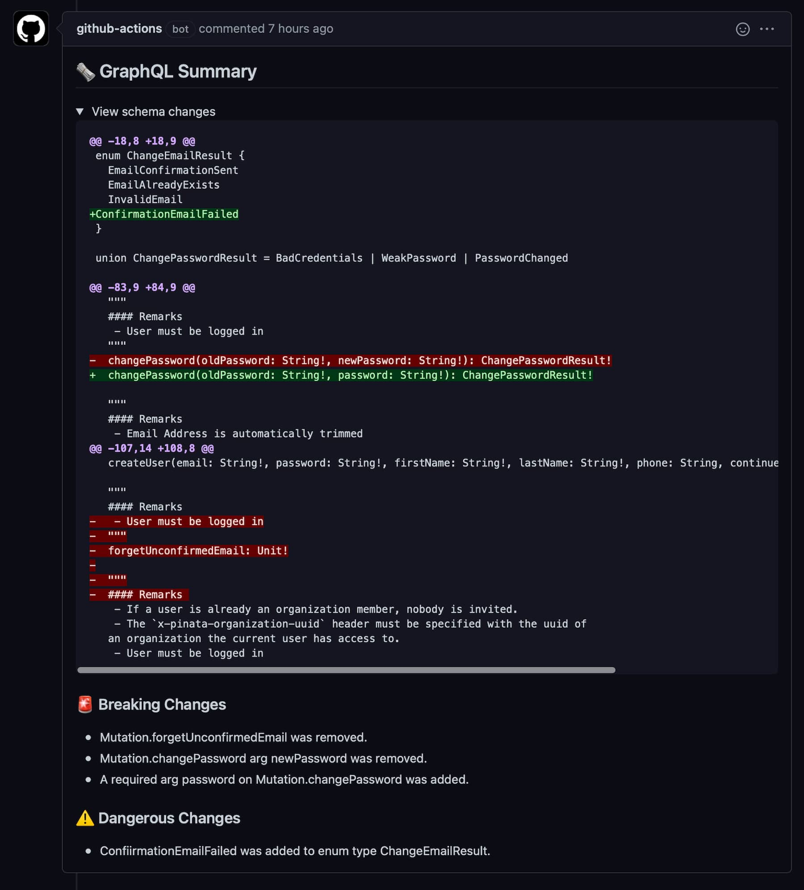

# gql-diff-action

A neat summary of the changes you made to your GraphQL schema:



Supports generated schemas. See [Example Usage](#example-usage).

## Inputs

### `token`

A GitHub token used to post a comment to your PR.

``${{ secrets.GITHUB_TOKEN }}`` works here.

### `old-schema`

The schema before the change. This can be a GraphQL SDL file or an endpoint URL.

### `new-schema`

The schema after the change. This can be a GraphQL SDL file or an endpoint URL.

## Example usage

```yaml
uses: agu-z/gql-diff-action@v1
with:
  token: '${{ secrets.GITHUB_TOKEN }}'
  old-schema: '~/old-schema.gql'
  new-schema: '~/new-schema.gql'
```

The way you generate old and new schema files is up to you. 


The following example generates both schemas by running the server before and after the PR change:

```yaml
name: GraphQL diff

on: pull_request

jobs:
  build:
    runs-on: ubuntu-latest

    steps:
      - uses: actions/checkout@v2
        with:
          fetch-depth: 0
      
      - uses: actions/setup-node@v1
        with:
          node-version: 12.x
        
      - name: Generate new schema
        run: |
          npm install       # Install dependencies
          npm start &       # Start your server in the background
          SERVER_PID=$!     # Store server pid in order to stop it afterwards
          
          # Generate the new schema
          npx get-graphql-schema http://localhost:5000 ~/new-schema.gql
          
          kill $SERVER_PID  # Stop server. This is necessary to free up the port.
           
      - name: Check out PR base ref
        run: |
          git checkout ${{ github.event.pull_request.base.sha }}
         
      - name: Generate old schema
        run: |
          npm install       # Install dependencies
          npm start &       # Start your server in the background
          SERVER_PID=$!     # Store server pid in order to stop it afterwards

          # Generate the old schema
          npx get-graphql-schema http://localhost:5000 ~/old-schema.gql

          kill $SERVER_PID  # Stop server
          
      - uses: agu-z/gql-diff-action@v1
        with:
          token: '${{ secrets.GITHUB_TOKEN }}'
          old-schema: '~/old-schema.gql'
          new-schema: '~/new-schema.gql'

```

This is an example for an API written in Node but the same idea works for any language or framework as long as you can start the server in your workflow.

 
__

This action uses [`graphql-schema-diff`](https://github.com/fabsrc/graphql-schema-diff). Thanks [fabsrc](https://github.com/fabsrc)!

Agus Zubiaga 2020

MIT licensed
